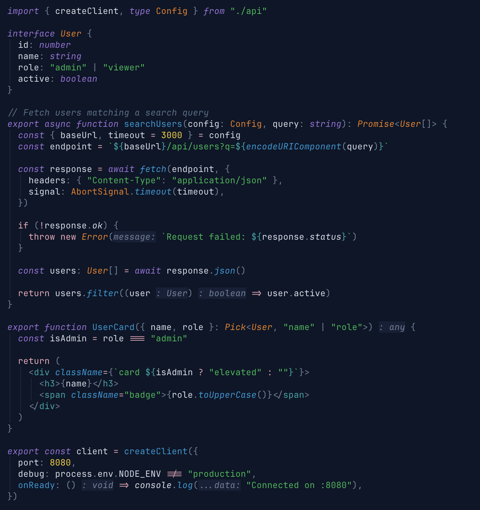

<p align="center">
  
</p>

<h1 align="center">Mind the Gap</h1>

<p align="center">
  A vibrant dark color theme inspired by the London Underground tube map.<br />
  Built for Neovim, VS Code, terminals, tmux, and CLI tools.
</p>

<p align="center">
  
</p>

## Features

- **Tube map colours** — every accent is named after a line, using official TfL values where possible
- **Single source of truth** — every color lives in `palette.json`, all outputs are generated
- **WCAG AA contrast** — validated at build time, never ships unreadable text
- **15 Neovim plugin integrations** — Telescope, cmp, gitsigns, mini.nvim, noice, trouble, flash, snacks, and more
- **Treesitter + LSP semantic tokens** — full highlighting with 450+ groups
- **13 terminal/CLI targets** — Kitty, Alacritty, WezTerm, Ghostty, iTerm2, foot, Windows Terminal, tmux, fzf, bat, delta, lazygit, OpenCode
- **Transparent mode** — use your terminal's background
- **Configurable italics** — toggle italics for comments and keywords

## Palette

<table>
  <tr>
    <td>
      <br />
      <strong>Elizabeth</strong><br />
      <code>#9B70D8</code><br />
      <sub>keywords, primitives</sub>
    </td>
    <td>
      <br />
      <strong>Hammersmith</strong><br />
      <code>#F3A9BB</code><br />
      <sub>operators, flow</sub>
    </td>
    <td>
      <br />
      <strong>Overground</strong><br />
      <code>#EE7C0E</code><br />
      <sub>types, components</sub>
    </td>
    <td>
      <br />
      <strong>District</strong><br />
      <code>#00B850</code><br />
      <sub>strings, additions</sub>
    </td>
  </tr>
  <tr>
    <td>
      <br />
      <strong>Victoria</strong><br />
      <code>#0098D4</code><br />
      <sub>functions, props</sub>
    </td>
    <td>
      <br />
      <strong>DLR</strong><br />
      <code>#00A4A7</code><br />
      <sub>tags, escape</sub>
    </td>
    <td>
      <br />
      <strong>Central</strong><br />
      <code>#E32017</code><br />
      <sub>errors, deletions</sub>
    </td>
    <td>
      <br />
      <strong>Circle</strong><br />
      <code>#FFD300</code><br />
      <sub>numbers, warnings</sub>
    </td>
  </tr>
</table>

<details>
<summary>Backgrounds &amp; foregrounds</summary>

| Swatch | Name | Hex | Role |
|--------|------|-----|------|
|  | Crust | `#04081a` | Deepest background |
|  | Mantle | `#081020` | Status bars, borders |
|  | Base | `#0c1628` | Editor background |
|  | Surface 0 | `#162038` | Floats, selections |
|  | Surface 1 | `#1e2844` | Active UI elements |
|  | Surface 2 | `#283450` | Scrollbars, subtle UI |

| Swatch | Name | Hex | Role |
|--------|------|-----|------|
|  | Text | `#d8dce8` | Primary text |
|  | Subtext | `#a8b0c0` | Secondary text |
|  | Overlay | `#708098` | UI elements |
|  | Comment | `#587088` | Comments |

</details>

## Installation

### Neovim

#### lazy.nvim

```lua
{
  "danfry1/mind-the-gap",
  lazy = false,
  priority = 1000,
  config = function()
    require("mindthegap").setup()
    vim.cmd("colorscheme mindthegap")
  end,
}
```

<details>
<summary>packer.nvim</summary>

```lua
use {
  "danfry1/mind-the-gap",
  config = function()
    require("mindthegap").setup()
    vim.cmd("colorscheme mindthegap")
  end,
}
```

</details>

#### Options

All options are optional — defaults work out of the box.

```lua
require("mindthegap").setup({
  transparent = false, -- set to true to use your terminal's background
  italics = true,      -- set to false to disable italic comments/keywords
  palette_overrides = { -- override base palette colors before they cascade to all groups
    foregrounds = { text = "#c8c8d8" },
    accents = { elizabeth = "#8060C0" },
  },
  custom_highlights = function(colors, variant)
    return {
      Normal = { bg = "#101828" },
    }
  end,
})
```

#### Plugin support

Highlight groups are included for these plugins (loaded automatically, no config needed):

| Plugin | Plugin | Plugin |
|--------|--------|--------|
| [telescope.nvim](https://github.com/nvim-telescope/telescope.nvim) | [nvim-cmp](https://github.com/hrsh7th/nvim-cmp) | [gitsigns.nvim](https://github.com/lewis6991/gitsigns.nvim) |
| [mini.nvim](https://github.com/echasnovski/mini.nvim) | [noice.nvim](https://github.com/folke/noice.nvim) | [nvim-notify](https://github.com/rcarriga/nvim-notify) |
| [trouble.nvim](https://github.com/folke/trouble.nvim) | [flash.nvim](https://github.com/folke/flash.nvim) | [neo-tree.nvim](https://github.com/nvim-neo-tree/neo-tree.nvim) |
| [oil.nvim](https://github.com/stevearc/oil.nvim) | [lazy.nvim](https://github.com/folke/lazy.nvim) | [which-key.nvim](https://github.com/folke/which-key.nvim) |
| [indent-blankline.nvim](https://github.com/lukas-reineke/indent-blankline.nvim) | [dashboard-nvim](https://github.com/nvimdev/dashboard-nvim) / [alpha-nvim](https://github.com/goolord/alpha-nvim) | [snacks.nvim](https://github.com/folke/snacks.nvim) |

---

### VS Code

Search for **"Mind the Gap"** in the Extensions Marketplace, or install from the command line:

```bash
code --install-extension DanielFry.mind-the-gap-color-theme
```

<details>
<summary>Install from source</summary>

```bash
cd editors/vscode
npx @vscode/vsce package
code --install-extension mind-the-gap-color-theme-*.vsix
```

</details>

---

### Zed

Search for **"Mind the Gap"** in the Zed extension marketplace, or install locally:

```bash
mkdir -p ~/.config/zed/themes
cp editors/zed/themes/mindthegap.json ~/.config/zed/themes/
```

Then select **Mind the Gap** from the theme picker (`cmd+k cmd+t`).

---

### Terminals

<details>
<summary>Kitty</summary>

```bash
curl -o ~/.config/kitty/mindthegap.conf https://raw.githubusercontent.com/danfry1/mind-the-gap/main/terminals/kitty/mindthegap.conf
```

Then add to `~/.config/kitty/kitty.conf`:

```
include mindthegap.conf
```

</details>

<details>
<summary>Alacritty</summary>

```bash
curl -o ~/.config/alacritty/mindthegap.toml https://raw.githubusercontent.com/danfry1/mind-the-gap/main/terminals/alacritty/mindthegap.toml
```

Then add to `~/.config/alacritty/alacritty.toml`:

```toml
import = ["~/.config/alacritty/mindthegap.toml"]
```

</details>

<details>
<summary>WezTerm</summary>

```bash
mkdir -p ~/.config/wezterm/colors
curl -o ~/.config/wezterm/colors/mindthegap.toml https://raw.githubusercontent.com/danfry1/mind-the-gap/main/terminals/wezterm/mindthegap.toml
```

Then set in `~/.config/wezterm/wezterm.lua`:

```lua
config.color_scheme = "Mind the Gap"
```

</details>

<details>
<summary>iTerm2</summary>

```bash
curl -o /tmp/mindthegap.itermcolors https://raw.githubusercontent.com/danfry1/mind-the-gap/main/terminals/iterm2/mindthegap.itermcolors
open /tmp/mindthegap.itermcolors
```

Then go to **iTerm2 > Settings > Profiles > Colors > Color Presets...** and select **Mind the Gap**.

</details>

<details>
<summary>Ghostty</summary>

```bash
mkdir -p ~/.config/ghostty/themes
curl -o ~/.config/ghostty/themes/mindthegap https://raw.githubusercontent.com/danfry1/mind-the-gap/main/terminals/ghostty/mindthegap
```

Then add to `~/.config/ghostty/config`:

```
theme = mindthegap
```

</details>

<details>
<summary>foot</summary>

```bash
curl -o ~/.config/foot/mindthegap.ini https://raw.githubusercontent.com/danfry1/mind-the-gap/main/terminals/foot/mindthegap.ini
```

Then add to `~/.config/foot/foot.ini`:

```ini
include=~/.config/foot/mindthegap.ini
```

</details>

<details>
<summary>Windows Terminal</summary>

```powershell
curl -o "$env:LOCALAPPDATA\mindthegap.json" https://raw.githubusercontent.com/danfry1/mind-the-gap/main/terminals/windows-terminal/mindthegap.json
```

Then copy the contents into the `schemes` array in your Windows Terminal `settings.json`, and set `"colorScheme": "Mind the Gap"` on the desired profile.

</details>

---

### Tmux

**Via TPM (recommended)**

```tmux
# ~/.tmux.conf
set -g @plugin 'danfry1/mind-the-gap'
run '~/.tmux/plugins/tpm/tpm'
```

<details>
<summary>Manual</summary>

```bash
# In ~/.tmux.conf
run-shell /path/to/mind-the-gap/tmux/mindthegap.tmux
```

</details>

---

### CLI Tools

<details>
<summary>fzf</summary>

```bash
curl -o ~/.config/fzf/mindthegap.sh https://raw.githubusercontent.com/danfry1/mind-the-gap/main/cli/fzf/mindthegap.sh
```

Then source it in your shell rc:

```bash
source ~/.config/fzf/mindthegap.sh
```

</details>

<details>
<summary>bat</summary>

```bash
curl -o "$(bat --config-dir)/themes/mindthegap.tmTheme" https://raw.githubusercontent.com/danfry1/mind-the-gap/main/cli/bat/mindthegap.tmTheme
bat cache --build
```

Then set the theme in `~/.config/bat/config`:

```
--theme="Mind the Gap"
```

</details>

<details>
<summary>delta</summary>

```bash
curl -s https://raw.githubusercontent.com/danfry1/mind-the-gap/main/cli/delta/mindthegap.gitconfig >> ~/.gitconfig
```

Then set delta as your Git pager in `~/.gitconfig`:

```ini
[core]
  pager = delta
```

</details>

<details>
<summary>lazygit</summary>

```bash
curl -s https://raw.githubusercontent.com/danfry1/mind-the-gap/main/cli/lazygit/mindthegap.yml >> "$(lazygit --print-config-dir)/config.yml"
```

</details>

<details>
<summary>OpenCode</summary>

```bash
mkdir -p ~/.config/opencode/themes
curl -o ~/.config/opencode/themes/mindthegap.json https://raw.githubusercontent.com/danfry1/mind-the-gap/main/cli/opencode/mindthegap.json
```

Then select Mind the Gap using the `/theme` command in OpenCode, or set it in your `tui.json`:

```json
{
  "theme": "mindthegap"
}
```

</details>

---

## Contributing

`palette.json` is the single source of truth for all colors. All theme files are generated from it.

```bash
bun install          # install dependencies
bun run generate     # regenerate all outputs from palette.json
bun test             # run tests
bun run validate     # check WCAG AA contrast ratios
bun run check        # verify generated files are up to date
bun run typecheck    # typecheck TypeScript
```

Please run `bun run generate` and commit the results before opening a PR.

## License

[MIT](LICENSE)
